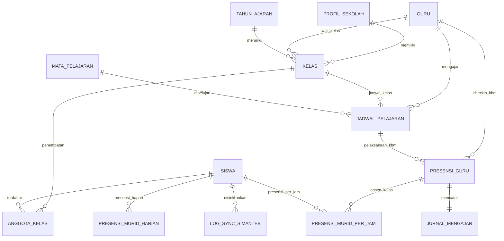

# Desain Database & Skema Master Data SMA AWH

Dokumen ini berisi perancangan database relasional untuk **Sistem Informasi SMA KH. A. Wahid Hasyim (SMA AWH)** berdasarkan analisis data dari dua dokumen master:
1. 📄 **`docs/data sekolah dan guru.pdf`**: Profil Sekolah & Master 58 Guru/Karyawan.
2. 📊 **`docs/1. ABSENSI SISWA 2026 - 2027.xlsx`**: Master 24 Rombel/Kelas, Wali Kelas, dan 732 Siswa beserta skema Absensi Harian & Absen Piket (per-jam pelajaran).

---

## 📌 Ringkasan Data Master Terintegrasi

| Entitas | Jumlah Record | Sumber Data | Keterangan |
|---|---|---|---|
| **Profil Sekolah** | 1 Instansi | `data sekolah dan guru.pdf` | Identitas, NSS (20540007), Izin, Alamat, Kepala Sekolah, Komite |
| **Guru & Karyawan** | 58 Orang | `data sekolah dan guru.pdf` | Gelar, Pendidikan Terakhir, Status Kepegawaian |
| **Kelas / Rombel** | 24 Kelas | `1. ABSENSI SISWA 2026 - 2027.xlsx` | Kelas X.1–X.8, XI.1–XI.9, XII.1–XII.7 + Masing-masing Wali Kelas |
| **Siswa / Peserta Didik** | 732 Siswa | `1. ABSENSI SISWA 2026 - 2027.xlsx` | NIS, Nama Lengkap, Jenis Kelamin (L/P), No. Urut Kelas |
| **Seed File Siap Pakai** | `docs/db_seed_data.json` | Parsed Auto Generator | File JSON hasil ekstraksi otomatis untuk Laravel Database Seeder |

---

## 🏗️ Skema Relasi Database (ERD & Table Schema)

---

## 🗄️ Detail Struktur Tabel

### 1. `profil_sekolah`
* `id` (PK, INT AUTO_INCREMENT)
* `nama_sekolah` (VARCHAR 150) -> *"SMA ABDUL WAHID HASYIM TEBUIRENG"*
* `nss` (VARCHAR 30) -> *"20540007"*
* `izin_operasional` (VARCHAR 100) -> *"421.3/1521/415.28/2014"*
* `luas_tanah_m2` (INT) -> *12300*
* `alamat` (TEXT) -> *"Jl. Irian jaya no.10 Tebuireng, Cukir"*
* `kecamatan` (VARCHAR 50) -> *"Diwek"*
* `kabupaten` (VARCHAR 50) -> *"Jombang"*
* `provinsi` (VARCHAR 50) -> *"Jawa Timur"*
* `kepala_sekolah` (VARCHAR 150) -> *"Drs. H. Hari Winarto, MM."*
* `ketua_komite` (VARCHAR 150) -> *"Drs. Fahmi Amrullah Hadzik"*

### 2. `guru` (Tenaga Pendidik & Karyawan)
* `id` (PK, INT AUTO_INCREMENT)
* `user_id` (FK `users.id`, NULLABLE)
* `nip` (VARCHAR 50, NULLABLE)
* `nama_lengkap` (VARCHAR 150)
* `gelar_depan` (VARCHAR 30, NULLABLE)
* `gelar_belakang` (VARCHAR 30, NULLABLE)
* `pendidikan_terakhir` (VARCHAR 100)
* `status_kepegawaian` (ENUM: 'PNS', 'GTT', 'Honorer', 'Tetap_Yayasan')
* `is_wali_kelas` (BOOLEAN, DEFAULT FALSE)
* `is_guru_piket` (BOOLEAN, DEFAULT FALSE)

### 3. `tahun_ajaran`
* `id` (PK, INT AUTO_INCREMENT)
* `tahun_ajaran` (VARCHAR 20) -> *"2026/2027"*
* `semester` (ENUM: 'Ganjil', 'Genap')
* `is_active` (BOOLEAN, DEFAULT TRUE)

### 4. `kelas` (Rombongan Belajar)
* `id` (PK, INT AUTO_INCREMENT)
* `tahun_ajaran_id` (FK `tahun_ajaran.id`)
* `tingkat` (ENUM: 'X', 'XI', 'XII')
* `nama_kelas` (VARCHAR 20) -> *"X.1", "X.2", "XI.1", "XII.1"*
* `wali_kelas_id` (FK `guru.id`, NULLABLE)

### 5. `siswa` (Peserta Didik)
* `id` (PK, INT AUTO_INCREMENT)
* `nis` (VARCHAR 30, UNIQUE) -> Nomor Induk Siswa (e.g. *"16120"*, *"16384"*)
* `nisn` (VARCHAR 30, UNIQUE, NULLABLE) -> Nomor Induk Siswa Nasional
* `nis_pondok` (VARCHAR 30, NULLABLE) -> NIS Pondok Tebuireng
* `nama_lengkap` (VARCHAR 150)
* `jenis_kelamin` (ENUM: 'L', 'P')
* `status` (ENUM: 'Aktif', 'Lulus', 'Pindah', 'Keluar', DEFAULT 'Aktif')

### 6. `anggota_kelas` (Pivot Rombel per Tahun Ajaran)
* `id` (PK, INT AUTO_INCREMENT)
* `kelas_id` (FK `kelas.id`)
* `siswa_id` (FK `siswa.id`)
* `no_urut` (INT) -> Nomor Urut Siswa di Kelas (1..40)
* `tahun_ajaran_id` (FK `tahun_ajaran.id`)

### 7. `mata_pelajaran`
* `id` (PK, INT AUTO_INCREMENT)
* `kode_mapel` (VARCHAR 20, UNIQUE)
* `nama_mapel` (VARCHAR 100)
* `kelompok` (ENUM: 'Wajib', 'Peminatan', 'Muatan_Lokal')

### 8. `jadwal_pelajaran`
* `id` (PK, INT AUTO_INCREMENT)
* `kelas_id` (FK `kelas.id`)
* `mapel_id` (FK `mata_pelajaran.id`)
* `guru_id` (FK `guru.id`)
* `hari` (ENUM: 'Senin', 'Selasa', 'Rabu', 'Kamis', 'Jumat', 'Sabtu')
* `jam_ke_mulai` (TINYINT) -> (1..10)
* `jam_ke_selesai` (TINYINT) -> (1..10)
* `waktu_mulai` (TIME)
* `waktu_selesai` (TIME)

### 9. `presensi_guru` (GPS Check-In & Inval)
* `id` (PK, INT AUTO_INCREMENT)
* `jadwal_id` (FK `jadwal_pelajaran.id`)
* `guru_id` (FK `guru.id`) -> Guru Pengajar Utama
* `guru_inval_id` (FK `guru.id`, NULLABLE) -> Jika diisi, di-takeover oleh Guru Piket/Inval
* `tanggal` (DATE)
* `jam_ke` (TINYINT)
* `waktu_checkin` (DATETIME)
* `waktu_checkout` (DATETIME, NULLABLE)
* `latitude` (DECIMAL(10, 8)) -> Validasi Radius GPS sekolah
* `longitude` (DECIMAL(11, 8))
* `status_kehadiran` (ENUM: 'Hadir', 'Izin', 'Sakit', 'Dinas_Luar', 'Inval')

### 10. `jurnal_mengajar`
* `id` (PK, INT AUTO_INCREMENT)
* `presensi_guru_id` (FK `presensi_guru.id`, UNIQUE)
* `bab_materi` (TEXT) -> Pembahasan KBM
* `catatan_kelas` (TEXT, NULLABLE) -> Kondisi & catatan KBM
* `tugas_mandiri` (TEXT, NULLABLE) -> Tugas jika guru berhalangan

### 11. `presensi_murid_harian` (Absensi Wali Kelas / Harian Sekolah)
* `id` (PK, INT AUTO_INCREMENT)
* `siswa_id` (FK `siswa.id`)
* `kelas_id` (FK `kelas.id`)
* `tanggal` (DATE)
* `status` (ENUM: 'Hadir', 'Sakit', 'Izin', 'Alpa', 'Terlambat', 'Dispensasi')
* `keterangan` (VARCHAR 255, NULLABLE)
* `dicatat_oleh_id` (FK `users.id`)

### 12. `presensi_murid_per_jam` (Absen Piket per Jam Ke-1 s/d 10)
* `id` (PK, INT AUTO_INCREMENT)
* `presensi_guru_id` (FK `presensi_guru.id`)
* `siswa_id` (FK `siswa.id`)
* `tanggal` (DATE)
* `jam_ke` (TINYINT) -> (1..10)
* `status` (ENUM: 'Hadir', 'Sakit', 'Izin', 'Alpa', 'Terlambat', 'Dispensasi')
* `keterangan` (VARCHAR 255, NULLABLE)

### 13. `log_sync_simanteb` (Audit Webhook ke Portal Wali SIMANTEB)
* `id` (PK, INT AUTO_INCREMENT)
* `siswa_id` (FK `siswa.id`)
* `nisn` (VARCHAR 30)
* `nis_pondok` (VARCHAR 30, NULLABLE)
* `tanggal` (DATE)
* `status_harian` (ENUM: 'Hadir', 'Sakit', 'Izin', 'Alpa')
* `status_sync` (ENUM: 'Pending', 'Success', 'Failed')
* `response_api` (TEXT, NULLABLE)
* `synced_at` (DATETIME, NULLABLE)

---

## 🚀 Rencana Impor & Seeding Database

Data master dari file Excel & PDF telah secara otomatis diekstrak ke `docs/db_seed_data.json`.
Saat pengembangan backend Laravel dimulai, seeder dapat dibuat dengan alur:
1. `ProfilSekolahSeeder`: Membaca objek `sekolah` dari JSON.
2. `GuruSeeder`: Loop `guru` (58 record) untuk membuat akun `users` dan profil `guru`.
3. `KelasSeeder`: Loop `kelas` (24 rombel) dan menghubungkan dengan `guru` sebagai Wali Kelas.
4. `SiswaSeeder`: Loop `siswa` (732 record) untuk mengisi tabel `siswa` dan `anggota_kelas`.
